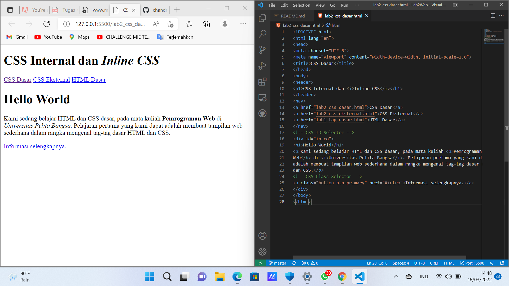
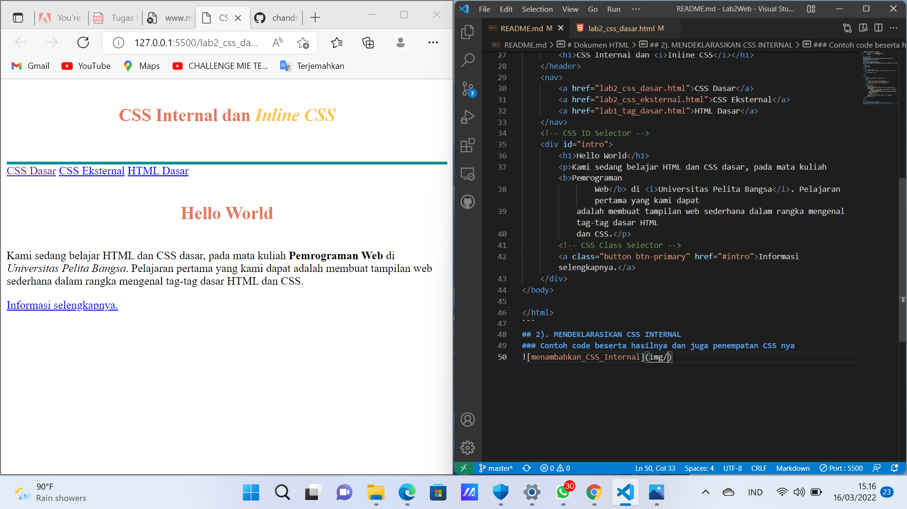
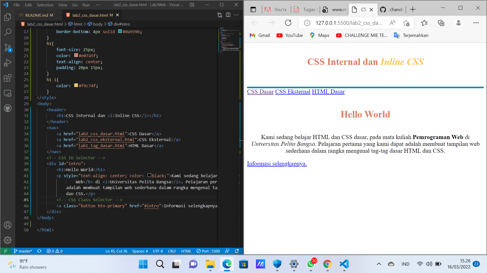
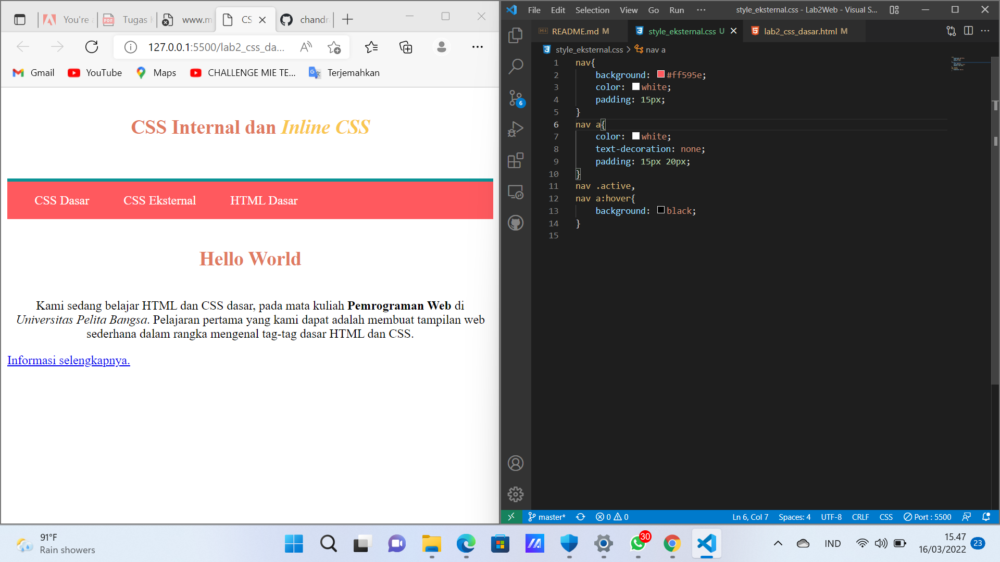
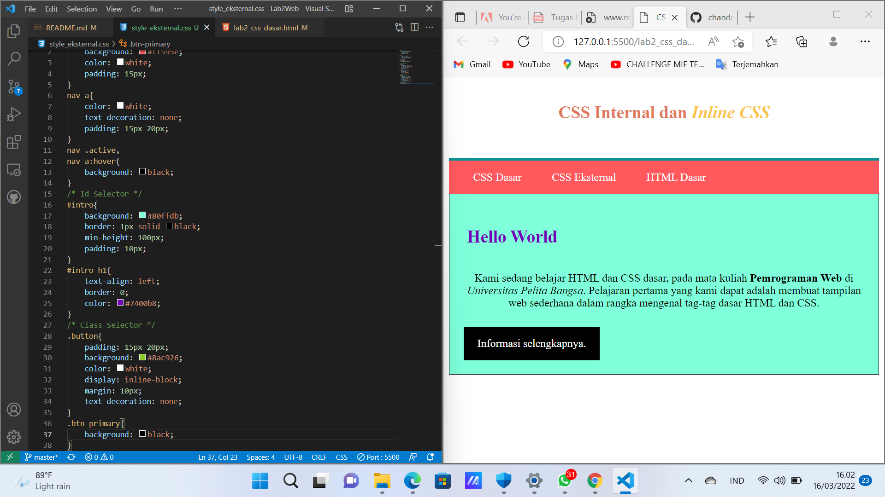

| Ahmad Alfian Chandra | 312010336         |
|--------------------- |-----------------  |
|       TI.20.A.2      | PEMROGRAMAN WEB   |
|          HTML        |        CSS        |

# 1 Judul Lab2Web
### Pertemuan 3
Untuk Matakuliah hari ini yang di pelajarkan yaitu mata kuliah Pemrograman Web tentang CSS dasar
# Dokumen HTML
### Contoh code dan Hasil nya

Disini sudah terdapar file Dokumen HTML yang belom terdapat file css nya

```html
<!DOCTYPE html>
<html lang="en">

<head>
    <meta charset="UTF-8">
    <meta name="viewport" content="width=device-width, initial-scale=1.0">
    <title>CSS Dasar</title>

</head>

<body>
    <header>
        <h1>CSS Internal dan <i>Inline CSS</i></h1>
    </header>
    <nav>
        <a href="lab2_css_dasar.html">CSS Dasar</a>
        <a href="lab2_css_eksternal.html">CSS Eksternal</a>
        <a href="lab1_tag_dasar.html">HTML Dasar</a>
    </nav>
    <!-- CSS ID Selector -->
    <div id="intro">
        <h1>Hello World</h1>
        <p>Kami sedang belajar HTML dan CSS dasar, pada mata kuliah <b>Pemrograman
                Web</b> di <i>Universitas Pelita Bangsa</i>. Pelajaran pertama yang kami dapat
            adalah membuat tampilan web sederhana dalam rangka mengenal tag-tag dasar HTML
            dan CSS.</p>
        <!-- CSS Class Selector -->
        <a class="button btn-primary" href="#intro">Informasi selengkapnya.</a>
    </div>
</body>

</html>
```
## 2). MENDEKLARASIKAN CSS INTERNAL
### Contoh code beserta hasilnya dan juga penempatan CSS nya

CSS internal adalah css yang filenya di letakan dalam html dengan pendeklarasian style.

## Source Code

```css
<style>
    body{
        font-family: 'Times New Roman', Times, serif;
    }
    header{
        min-height: 100px;
        border-bottom: 4px solid #0a9396;
    }
    h1{
        font-size: 25px;
        color: #e07a5f;
        text-align: center;
        padding: 20px 15px;
    }
    h1 i{
        color: #f9c74f;
    }
</style>
```
## 3). MENAMBAHKAN INLINE CSS
### Contoh code beserta hasil nya dan juga penempatan CSS nya!


CSS inline adalah css yang pendeklarasiannya di dalam elemen HTML dengan code style inline memiliki prioritas lebih kuat di banding internal dan external.
```html
<p style="text-align: center; color: black;">Kami sedang belajar HTML dan CSS dasar, pada mata kuliah <b>Pemrograman
                Web</b> di <i>Universitas Pelita Bangsa</i>. Pelajaran pertama yang kami dapat
            adalah membuat tampilan web sederhana dalam rangka mengenal tag-tag dasar HTML
            dan CSS.</p>
```
## 4). MEMBUAT CSS EKSTERNAL
### Contoh code dan penempatan CSS internal

CSS ekternal adalah CSS yang file di tempatkan di luar file HTML dengan menambahkan link dalam HTML agar tertaut dengan file CSS

```css
nav{
    background: #ff595e;
    color: white;
    padding: 15px;
}
nav a{
    color: white;
    text-decoration: none;
    padding: 15px 20px;
}
nav .active,
nav a:hover{
    background: black;
}

```
## 5). MENAMBAHKAN CSS SELECTOR 
### Contoh code dan juga selector

CSS Selector terdiri atas selector ID, Selector Class, Dan Selector elemen Selector ID pendeklarasiannya yaitu dengan (#), Sedangkan Class pendeklarasiannya yaitu dengan (.), Dan Selector elemen pendeklarasiannya dengan elemen HTML sebagai contoh (p) yang akan di beri gaya pada CSS.

## Source Code
```css
/* Id Selector */
#intro{
    background: #80ffdb;
    border: 1px solid black;
    min-height: 100px;
    padding: 10px;
}
#intro h1{
    text-align: left;
    border: 0;
    color: #7400b8;
}
/* Class Selector */
.button{
    padding: 15px 20px;
    background: #8ac926;
    color: white;
    display: inline-block;
    margin: 10px;
    text-decoration: none;
}
.btn-primary{
    background: black;
}
```
## PERTANYAAN DAN TUGAS
------------------------------------------------------------------------------------

### 1). Lakukan Eksperimen dengan mengubah dan menambah properti dan nilai pada kode CSS dengan mengacu pada CSS Cheat Sheet yang diberikan pada file terpisah dari modul ini.
```
```


Di Gambar berikut saya menambahkan **Border-radius:4px** pada nav a: hovernya, karena agar terlihat lebih rapih 
```css
border-radius: 4px;
```
### 2). Apa perbedaan pendeklarasian CSS elemen {h1} dengan {#intro h1} berikan penjelasan nya!
-----------------------------------------------------------------------------

**JAWABAN**

Jadi jika hanya mendeklarasian elemen **{h1}** saja berarti semua elemen **{h1}** akan berubah oleh CSS Sedangkan jika mendeklarasikan **{#intro h1}** hanya elemen h1 dengan deklrasi **{#intro h1}** saja yang berubah,karena **ID** itu unik.
```
```
### 3). Apabila ada  deklrasi CSS secara internal,lalu ditambahkan CSS Eksternal dan inline CSS pada elemen yang sama. Deklarasi manakah yang akan ditampilkan pada browser ? Berikan penjelasan dan contoh nya!
----------------------------------------------------------------------------------------------                                                                    

**JAWABAN**

Ketika kita mendeklarasikan secara bersamaan antara ***INTERNAL*** ***EKSTERNAL*** dan ***INLINE*** yang akan ditampilkan pada Browser adalah **INLINE** Karena **INLINE** Memiliki prioritas dibanding ***EKSTERNAL*** atau pun ***INTERNAL*** seperti contoh yang saya buat,saya membuat dokumen baru HTML kemudian saya buat Elemen ***{h1}*** yang kemudian saya akan deklarasikan di CSS ***INTERNAL*** ***EKSTERNAL*** dan juga ***INLINE*** Dengan property ***{color}*** dengan warna yang berbeda,jika ***INTERNAL*** {color: red} sementara ***EKSTERNAL*** {color:green;} dan ***INLINE*** {color: pink;} yang terpanggil dibrowser adalah ***INLINE*** karena memiliki prioritas.

## Contoh Hasil dan Code

**DI ATAS ADALAH DEKLARASI INLINE DAN INTERNAL SEMENTARA FOTO DIBAWAH ADALAH DEKLARASI EKSTERNAL NYA**


jadi yang terpanggil adalah ***CSS INLINE*** karena memiliki prioritas tinggi dibanding CSS deklarasi lain nya.
```
### 4). Pada sebuah elemen HTML terdapat ID dan Class,apabila masing-masing selector tersebut  terdapat deklarasi CSS , maka deklarasi manakah yang akan ditampilkan pada browser? Berikan penjelasan dan contohnya! 
```html
(<p id="paragraf-1" class="text-paragraf">)
```
----------------------------------------------------------------------------------------------

**JAWABAN**

Yang terpanggil dibrowser adalah **ID** karena **ID** bersifat unik berbeda dengan **Class** **Class** bisa digunakan banyak sementara **ID** hanya tertentu saja itu kenapa **ID** unik dan yang terpanggil di browser adalah **ID** .

## Contoh hasil dan Code nya


Disitu saya menambahkan property {color} dan {text-align} untuk **ID** {color: orange} dan {text-align: center} sementara **Class** yaitu {color:blueviolet} dan {text-align: left} namun yang terpanggil di browser adalah **ID** yang property nya {color: orange} dan juga {text-align: center} 
### Sekian TerimaKasih Mohon maaf apabila pejelasan yang saya sampaikan kurang jelas.